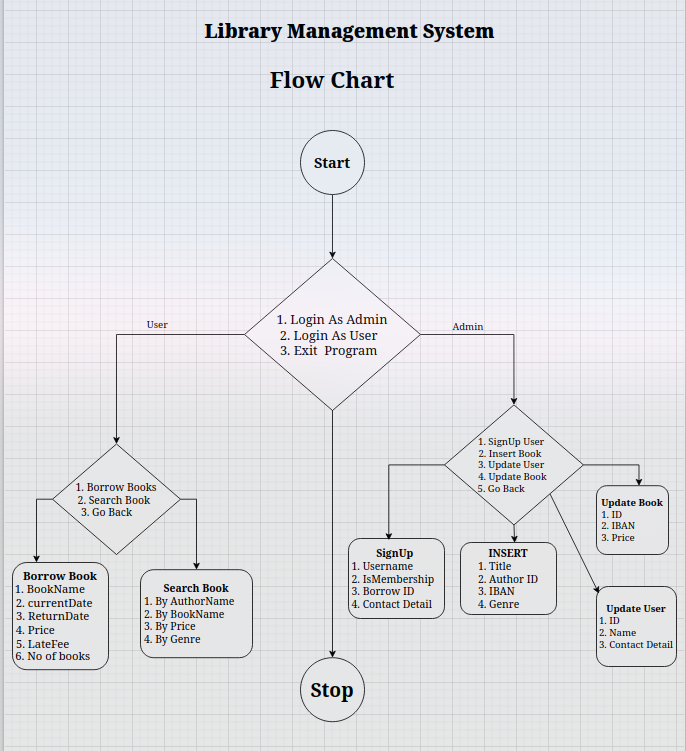

# Library Management System

C++ Program to store books for library. As admin you can create books, edit them, create new user or update User. As User you can search books.

## Functional requirements

- Database: Use SQLITE database to connect with C++. Store User, Books data on database

## Schema Design

## Project Flow

## Links of helping resourse

- [draw](draw.io)
- [SqliteC++ Wrapper](github.com/srombauts/sqlitecpp)
- [vcpkg](https://github.com/Microsoft/vcpkg)
- g++ testDB.cpp -o testDB -I"C:\Users\rdev\vcpkg\installed\x64-mingw-dynamic\include" -L"C:\Users\rdev\vcpkg\installed\x64-mingw-dynamic\lib" -lSQLiteCpp -lsqlite3
- git diff --staged > staged.log
